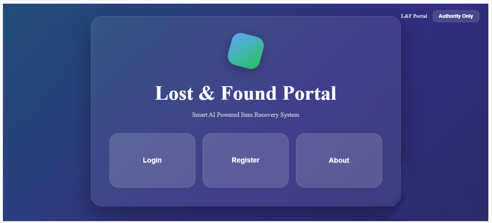
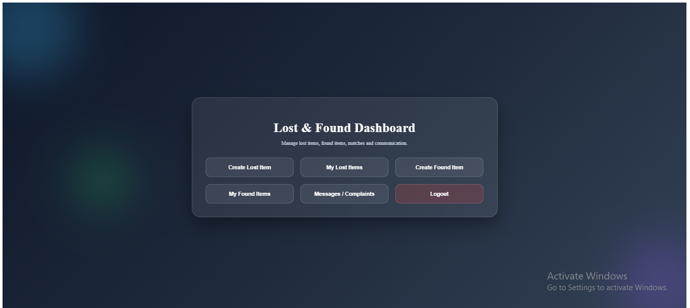
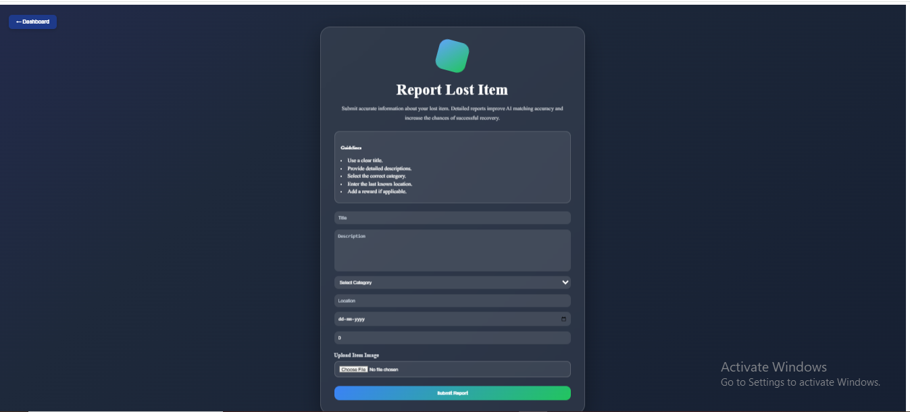
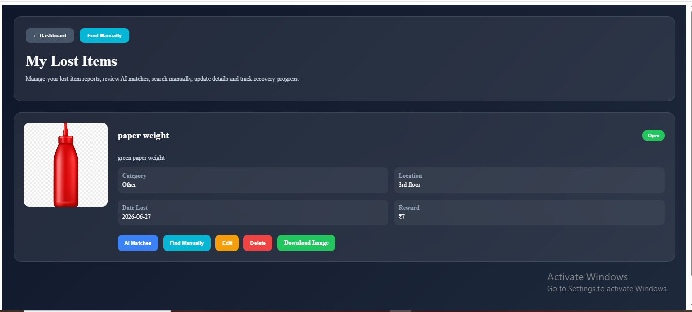
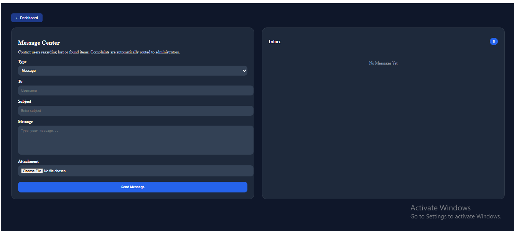
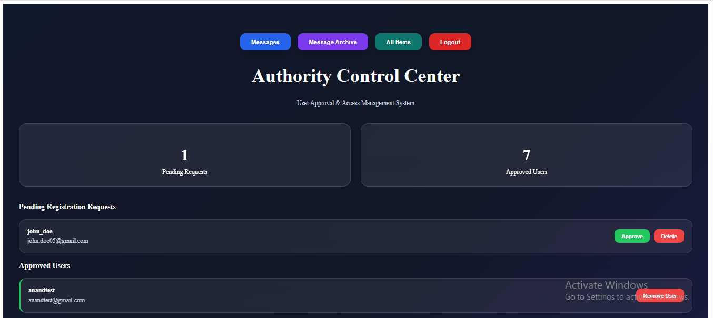

# LostLink

LostLink is an AI-assisted organizational lost and found management platform designed for small communities, offices, institutions, campuses, and other controlled environments.

The platform provides a centralized system where users can report lost and found items, upload supporting images, search for items, communicate with other users, submit claims, and contact administrators. Administrators can manage users, complaints, claims, messages, uploaded files, and item records through an administrative interface.

## Problem

Traditional lost and found systems often rely on manual announcements, spreadsheets, or informal communication. This can make it difficult to track reported items, identify potential matches, manage claims, and maintain a reliable history of lost and found records.

LostLink addresses this by providing a centralized platform for reporting, searching, matching, claiming, and managing lost and found items within an organization or controlled community.

## How LostLink Works

1. Users register and log into the platform.
2. Registered users can report lost or found items with descriptions, locations, dates, and images.
3. Lost and found records are stored centrally for searching and management.
4. Users can manually search available records or use the AI-assisted matching functionality to identify potentially related items.
5. Users can communicate with other users through the messaging system.
6. Users can submit claims for relevant lost items.
7. Administrators can review users, claims, complaints, messages, uploaded files, and item records.

## Features

### User Features

* User registration and login
* User approval system
* Report lost items
* Report found items
* Upload images for reported items
* Manually search lost and found items
* AI-assisted item search and matching
* View reported items
* Claim lost items
* Handle item claim requests
* Messaging between users
* Submit complaints to administrators
* Access uploaded files related to items and reports

### Admin Features

* Admin authentication
* Approve registered users
* View and manage users
* View lost and found item records
* Manage item claims
* Handle user complaints
* Communicate with users
* View archived messages
* Download uploaded files
* Maintain permanent lost and found records

## Screenshots

### Home Page



### User Dashboard



### Report Lost / Found Item



### AI-Assisted Matching



### Messaging



### Admin Dashboard



> Screenshots will be added to the repository as the project interface is documented.

## Technology Stack

### Backend

* Python
* Django
* Django REST Framework
* Django ORM
* SQLite
* REST APIs
* JWT Authentication

### Frontend

* Angular
* TypeScript
* HTML5
* CSS3
* Bootstrap
* Angular Material

## Authentication

LostLink uses JWT-based authentication for API access.

Users authenticate through the application and receive authentication tokens that are used when accessing protected API endpoints.

## File and Image Management

Users can upload images when reporting lost or found items.

The messaging system also supports file attachments, allowing relevant files to be shared between users.

## Project Structure

```text
LostLink/
│
├── backend/
│   ├── api/
│   │   ├── migrations/
│   │   ├── models.py
│   │   ├── serializers.py
│   │   ├── urls.py
│   │   └── views.py
│   │
│   ├── backend/
│   │   ├── settings.py
│   │   ├── urls.py
│   │   ├── asgi.py
│   │   └── wsgi.py
│   │
│   └── manage.py
│
├── frontend/
│   ├── src/
│   │   └── app/
│   │       ├── about/
│   │       ├── admin-dashboard/
│   │       ├── admin-login/
│   │       ├── create-found-item/
│   │       ├── create-lost-item/
│   │       ├── dashboard/
│   │       ├── found-item-details/
│   │       ├── home/
│   │       ├── login/
│   │       ├── message-center/
│   │       ├── my-found-items/
│   │       ├── my-lost-items/
│   │       ├── register/
│   │       └── view-matches/
│   │
│   ├── angular.json
│   ├── package.json
│   └── tsconfig.json
│
├── .gitignore
├── README.md
└── requirements.txt
```

## Installation

### 1. Clone the repository

```bash
git clone https://github.com/anandcreativezone-hash/LostLink.git
cd LostLink
```

### 2. Create and activate a Python virtual environment

**Windows:**

```bash
python -m venv fenv
fenv\Scripts\activate
```

**Git Bash:**

```bash
source fenv/Scripts/activate
```

### 3. Install backend dependencies

```bash
pip install -r requirements.txt
```

### 4. Configure environment variables

Create a `.env` file in the project root and add your own Django secret key:

```env
DJANGO_SECRET_KEY=your-secret-key-here
```

The `.env` file should not be committed to GitHub.

### 5. Run database migrations

```bash
cd backend
python manage.py migrate
```

### 6. Start the Django backend

```bash
python manage.py runserver
```

The backend will be available at:

```text
http://127.0.0.1:8000/
```

### 7. Install frontend dependencies

Open another terminal and navigate to the frontend:

```bash
cd frontend
npm install
```

### 8. Start the Angular frontend

```bash
ng serve
```

The Angular development server will provide the frontend URL in the terminal.

## Environment and Security

Sensitive configuration values such as the Django secret key are stored using environment variables rather than being exposed directly in the source code.

The repository excludes `.env` files and local virtual environments through `.gitignore`.

## Development Architecture

```text
Angular Frontend
       │
       │ REST API / JWT
       ▼
Django REST Framework
       │
       ▼
Django ORM
       │
       ▼
SQLite Database
```

## Future Improvements

* More advanced AI-based item matching
* Improved notification system
* Email notifications
* Advanced search and filtering
* Organization-specific configurations
* Improved claim verification
* Production database deployment
* Cloud-based media storage
* Mobile application support

## Author

**Anand T**

GitHub: https://github.com/anandcreativezone-hash

## License

This project was developed as a final project for educational and portfolio purposes.
